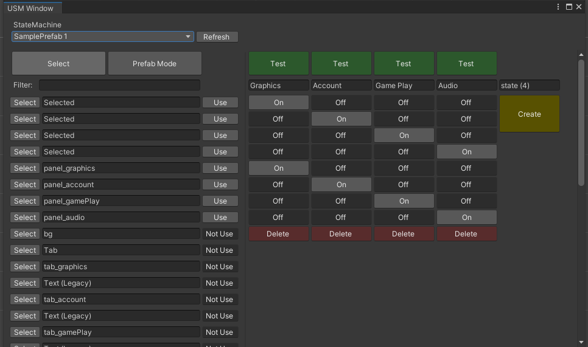

# usm
Ui State Machine

## Table of Contents
- [Introduction](#introduction)
- [License](https://github.com/grobiann/usm?tab=readme-ov-file#License)
- [UPM Package](https://github.com/grobiann/usm?tab=readme-ov-file#UPM-Package)
  - [Install via git URL](https://github.com/grobiann/usm?tab=readme-ov-file#Install-via-git-url)

## Introduction
The UI State Machine is designed to help developers manage complex UI states with ease. It provides a clear structure for defining and transitioning between various UI states, making your code more organized and maintainable.

## UPM Package
### Install via git URL
Requires a version of unity that supports path query parameter for git packages (Unity >= 2019.3.4f1, Unity >= 2020.1a21). You can add `https://github.com/grobiann/usm.git?path=Assets/usm` to Package Manager

or add "com.jjs.usm": `"https://github.com/grobiann/usm.git?path=Assets/usm"` to Packages/manifest.json.

If you want to set a target version, UniTask uses the `*.*.*` release tag so you can specify a version like `#0.0.4`. For example `https://github.com/grobiann/usm.git?path=Assets/usm#0.0.4`.

## License
This library is under the MIT License.
