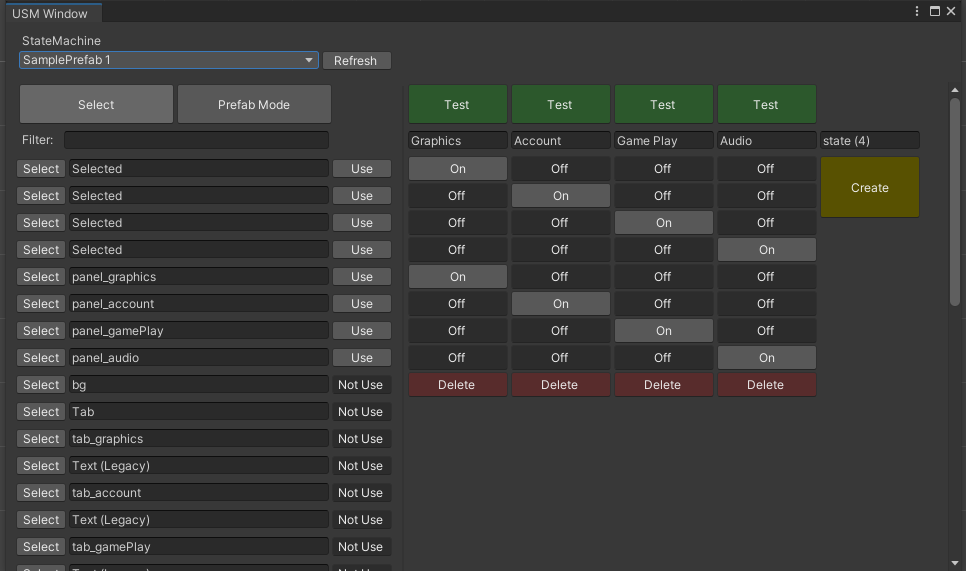

# usm
Ui State Machine

## Table of Contents
- [Introduction](#introduction)
- [Usage](#usage)
- [Example](#example)
- [프리팹과의 관계](#Monobehaviour를 상속받음)
- [License](https://github.com/grobiann/usm?tab=readme-ov-file#License)
- [UPM Package](https://github.com/grobiann/usm?tab=readme-ov-file#UPM-Package)
  - [Install via git URL](https://github.com/grobiann/usm?tab=readme-ov-file#Install-via-git-url)

## Introduction
The UI State Machine is designed to help developers manage complex UI states with ease. It provides a clear structure for defining and transitioning between various UI states, making your code more organized and maintainable.



## Usage
To use the UI State Machine in your project, follow these steps:

1. Import the UI State Machine package into your project.
2. Add the `UiStateMachineBehaviour` class to your GameObject.
3. Open the USM Window by clicking the 'Open USM Window' button in the inspector of the `UiStateMachineBehaviour` class.
4. Create states and set the active state of the gameObjects in the USM Window.
5. Click the green 'Test' button to easily preview each state.
6. Change the state of the USM either through scripts or using Unity events.

## Example
You can see this example in the `SampleScene` included in the package.

Here's a basic example of how to set up and use the UI State Machine:

```csharp
public class Usm_Sample : MonoBehaviour
{
    public UiStateMachineBehaviour usm_tab;
    public UiStateMachineBehaviour usm_graphic;

    private int _indexGraphics = 0;

    private void Awake()
    {
        SelectTab("Graphics");
    }

    public void SelectTab(string tabName)
    {
        usm_tab.Play(tabName);

        StopAllCoroutines();
        if (tabName == "Graphics")
        {
            StartCoroutine(ChangeGraphics_Periodically());
        }
    }

    IEnumerator ChangeGraphics_Periodically()
    {
        var graphicStates = usm_graphic.usm.states;
        Debug.Assert(graphicStates.Count > 0);

        while (true)
        {
            var state = graphicStates[_indexGraphics];
            usm_graphic.Play(state);
            yield return new WaitForSeconds(2.0f);

            _indexGraphics += 1;
            if (_indexGraphics >= graphicStates.Count)
                _indexGraphics = 0;
        }
    }
}
```

## Monobehaviour를 상속받음
usm의 `UiStateMachineBehaviour`은 `MonoBehaviour`를 상속받았기 때문에, 게임오브젝트 혹은 프리팹과 함께 저장할 수 있습니다.
따라서 데이터를 복사하거나, 수정하고, 되돌리는데에 용이합니다.

프리팹 내에서 usm을 사용하는경우, 외부에서 override하지 않도록 주의하십시오. `usm window`는 프리팹모드에서의 수정을 지원합니다. 프리팹모드가 아닌 상태에서 프리팹을 수정하려 하면, 자동으로 프리팹모드로 이동됩니다.


## UPM Package
### Install via git URL
Requires a version of unity that supports path query parameter for git packages (Unity >= 2019.3.4f1, Unity >= 2020.1a21).
You can add `https://github.com/grobiann/usm.git?path=Assets/usm` to Package Manager


or add "com.jjs.usm": `"https://github.com/grobiann/usm.git?path=Assets/usm"` to Packages/manifest.json.

If you want to set a target version, UniTask uses the `*.*.*` release tag so you can specify a version like `#0.0.4`. For example `https://github.com/grobiann/usm.git?path=Assets/usm#0.0.4`.

## License
This library is under the MIT License.
